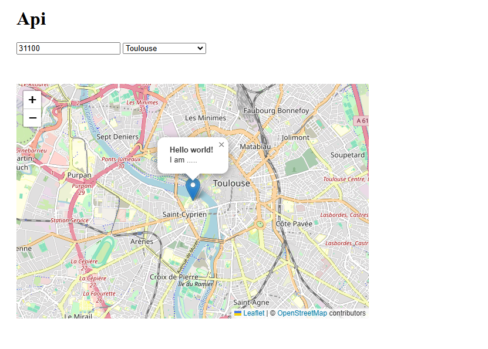

# **README API**
 
## **API Map**
## **Introduction**
 
This project allows users to display an interactive map where they can select a city based on its postal code. Once a city is selected, the map updates to center on that city, and a marker is placed at its location.

## **Main function of the project**

This function allow users to select a city based on a postal code and automatically update an interactive map to center on the selected city, with a marker indicating its exact location.
 
 

```
selctVille.addEventListener("change", () => {
    let villeCode = selctVille.value;
    let villeSelected = villesData.find(ville => ville.code === villeCode);

    if (villeSelected && villeSelected.centre && villeSelected.centre.coordinates) {
        const [lng, lat] = villeSelected.centre.coordinates; 
        console.log("Coordinates selected :", lat, lng); 

        marker.setLatLng([lat, lng]);
        // Positionner le marker aprés avoir longitude et latitude
        map.setView([lat, lng], 13);   

        console.log("Put marker in :", [lat, lng]);
        // Si y'a pas la longitude et latitude envoie "Error"
    } else {
        console.log("Error.");
    }
});
 
```

## **Display Result**



 
## **if you have question about the project you can contact me on my [linkedIn]()**